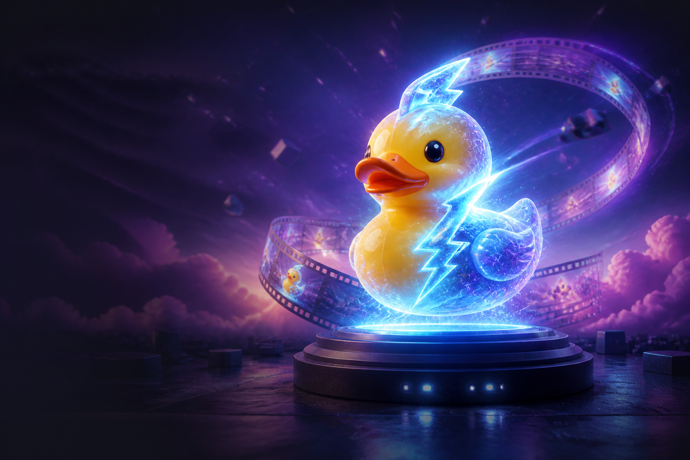
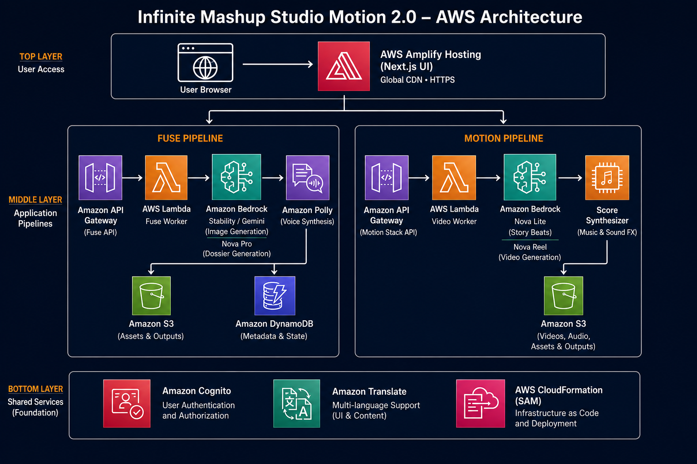
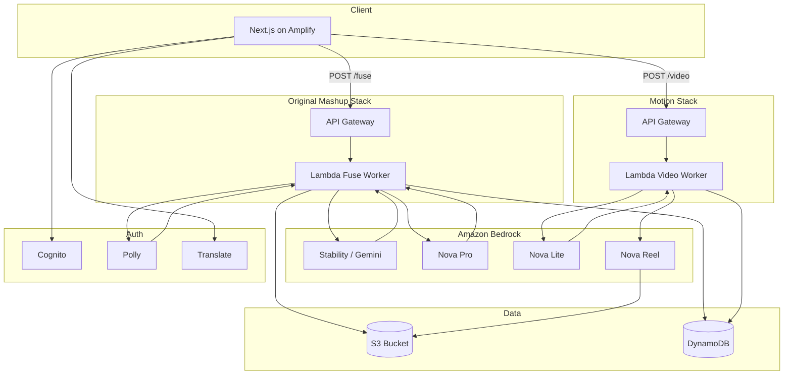

# Weekend Showcase Challenge: Infinite Mashup Studio Motion 2.0



`#application`

**Builder tag:** @Lewis Sawe

**Inspired by:** [@Lewis Sawe](https://builder.aws.com/community/connect/community-users/@Lewis%20Sawe) and **The Museum That Grows** — an always-on agent that keeps building, curating, and expanding without waiting for someone to click a button. That idea stuck with me: artifacts should not sit behind glass. They should keep becoming something. Motion 2.0 is my version of that instinct applied to inventions — the still image stays, but the origin story does not freeze on the wall. Nova Reel turns lore into motion, beat by beat, the way a living museum adds new rooms instead of locking the doors at closing time.

---

## Before you read this: where Motion 2.0 came from

I built **Infinite Mashup Studio** for the AWS Creative App Challenge and submitted it. That version is live, judged, and intentionally frozen — same repo, same stack, no changes until results are announced.

After I hit submit, one thought would not leave: the invention **looks** real, the origin story **reads** real, but nothing **moves**. The still image is a poster. The dossier is a museum label. I wanted the same studio — same fuse loop, same grounded storytelling — with a second act where the origin story becomes a motion reel.

That is **Infinite Mashup Studio Motion 2.0**. Not a different app. Not a mashup of other summer projects. The evolution of one creative pipeline, forked into a new repo and a new AWS stack so version 1 stays untouched.

---

# 1. Vision and what it does

## The problem

Most “AI invention” demos fail in the same way: you type a prompt, you get a paragraph and maybe an image, and the result feels like a chat reply — not an artifact you would keep, share, or show someone.

**Infinite Mashup Studio (v1)** already fixed part of that. You do not write a prompt. You **compose** two to five ingredients from a catalog (or upload photos). The system fuses them into one illustrated invention with a full dossier — name, tagline, abilities, personality, patent number, warning label — and a spoken origin story. Critically, Nova Pro writes the dossier **from the PNG**, not from the ingredient list. The language is grounded in what was actually painted.

What v1 still lacked was **time**. After you read the origin, the invention sits frozen on screen. Beautiful, but static. Like a movie poster without the movie.

## The solution

**Motion 2.0** adds motion without removing the still. The illustration always stays visible. The dossier and Polly narration stay. What is new:

1. **Animate** — Nova Reel turns the illustration + origin story into a story-length video
2. **Story-driven length** — longer origin → more cinematic beats → longer clip (not a fixed 6-second loop)
3. **Original AI score** — Nova picks tempo/key/mood; a synthesizer renders a unique WAV matched to clip length
4. **Motion styles** — cinematic, playful, or ominous
5. **Downloads** — PNG, MP4, and score WAV separately

## How it works (user journey)

```
┌─────────────────────────────────────────────────────────────────────┐
│                        USER JOURNEY                                 │
├─────────────────────────────────────────────────────────────────────┤
│                                                                     │
│  ① COMPOSE        Pick 2–5 ingredient chips or upload photos        │
│       │                                                             │
│       ▼                                                             │
│  ② FUSE           POST /fuse → jobId → worker paints + writes       │
│       │           Returns: PNG + dossier JSON + Polly MP3         │
│       ▼                                                             │
│  ③ EXPLORE        Read dossier, listen to origin, translate, share  │
│       │           Still image is always the hero                    │
│       ▼                                                             │
│  ④ ANIMATE        POST /mashups/{id}/video                          │
│       │           Nova Lite plans story beats from origin text      │
│       │           Nova Reel renders ~6s per beat (up to ~36s)      │
│       │           Score composed to match duration                  │
│       ▼                                                             │
│  ⑤ KEEP           Download PNG + MP4 + WAV · gallery · re-voice    │
│                                                                     │
└─────────────────────────────────────────────────────────────────────┘
```

A user opens the studio, picks ingredients like `Rubber Duck` + `Lightning` + `Velvet`, hits **Fuse**, and waits ~60–90 seconds. They land on a result page with the illustration, full dossier, and a **Listen** button. Then they choose a motion style and press **Animate**. The Motion panel shows render progress; when complete, the video plays beside the still with the original score synced underneath.

---

# 2. What evolved from version 1 → Motion 2.0

| Dimension | v1 (Creative Challenge) | v2 (Weekend Showcase) |
|---|---|---|
| **Core loop** | Ingredients → fuse → still + story | Same fuse loop, plus optional motion |
| **Illustration** | Stability / Gemini → PNG | Unchanged |
| **Story** | Nova Pro reads PNG → dossier | Unchanged — story now also drives video |
| **Audio** | Polly reads origin | Unchanged + voice picker + re-narrate |
| **Video** | None | Nova Reel story reel from PNG + origin |
| **Music** | None | Procedural AI score per invention |
| **UI** | Single result view | Still panel + separate Motion panel |
| **Hosting** | Netlify (original) | AWS Amplify (Motion fork) |
| **Backend** | `infinite-mashup-studio` stack | Original stack + `mashup-studio-motion` stack |
| **Repo** | Frozen | New: `mashup-studio-motion-2.0` |

The design rule for v2: **never replace the still with video**. Users get the poster and the trailer.

---

# 3. How you built it

## Process

1. **Forked the codebase** into `mashup-studio-motion` — left the original GitHub repo and SAM stack untouched
2. **Preserved the fuse worker** — same job pattern: API Gateway → Lambda → async worker → S3 + DynamoDB
3. **Added a Motion stack** — separate SAM deployment (`mashup-studio-motion`) with video routes, score module, Nova Reel IAM
4. **Split the frontend API** — `FUSE_API_URL` for fuse/gallery; `VIDEO_API_URL` for animate/narrate/score overlay
5. **Built story-driven video** — Nova Lite shot list → Nova Reel `TEXT_VIDEO` or `MULTI_SHOT_MANUAL`
6. **Deployed UI on AWS Amplify** — connected to GitHub, auto-build on push to `main`

## Key architectural decisions

### Decision 1: Video is a second job, not part of fuse

Nova Reel uses `StartAsyncInvoke` / `GetAsyncInvoke`. A single beat takes ~90 seconds; a six-beat story can run several minutes. The fuse worker already paints, writes, and narrates in one pass. Bolting video onto that job would blow Lambda timeouts and block the user from seeing their still.

**Result:** `POST /mashups/{id}/video` on the Motion API starts a separate async pipeline. The UI polls until `videoStatus === "COMPLETE"`.

### Decision 2: Story length drives video length

Nova Reel renders **6 seconds per shot**. Motion 2.0 counts words in the origin story and plans one shot per ~40 words (capped at 6 shots / ~36 seconds):

```python
def target_shot_count(text: str, max_shots: int = 6) -> int:
    words = len(text.split())
    return max(1, min(max_shots, (words + 39) // 40))
```

Nova Lite then returns a JSON shot list faithful to the story order:

```python
prompt = (
    f"You are a film director animating an invention called {name}.\n"
    f"Origin story:\n{story}\n\n"
    f"Split this into exactly {shot_count} visual beats for a short film.\n"
    'Return ONLY JSON: {"beats":["shot one","shot two",...]}'
)
resp = bedrock.converse(modelId="amazon.nova-lite-v1:0", messages=[...])
```

One beat → `TEXT_VIDEO`. Multiple beats → `MULTI_SHOT_MANUAL` with the same 1280×720 keyframe.

### Decision 3: Cross-stack compatibility

Fuses still run on the original API. The Motion endpoint accepts the full mashup payload in the POST body, so inventions created before the fork can still be animated without re-fusing.

### Decision 4: Original score, not licensed music

`lambda/score.py` asks Nova for tempo, root note, mode, and brightness. A small Python synthesizer renders a unique WAV from those parameters. No song titles, no samples, no copyright risk.

## Challenges (and how I solved them)

| Challenge | What happened | Fix |
|---|---|---|
| **S3 URI validation** | Nova Reel rejected `s3://bucket/videos` | Must use `s3://bucket/videos/` (trailing slash) |
| **Async polling** | Video stuck on PENDING after Lambda timeout | Background worker + `videoInvocationArn` on mashup record; GET finalizes on next poll |
| **Fixed 6s video** | Early version felt like a GIF, not a story | Story beat planner + multi-shot Reel |
| **Hosting** | Netlify deploy missed static assets (blank page) | Moved to **AWS Amplify** — builds from GitHub, SSR works |
| **Challenge integrity** | Could not modify v1 while judged | Fork: new repo, new stack, new URL |

---

# 4. AWS services used

Each service has a specific job in the pipeline. Motion 2.0 uses **two API Gateway stacks** (original fuse + motion) and **one Amplify app** for the UI.

| Service | What it does in Motion 2.0 |
|---|---|
| **AWS Amplify Hosting** | Hosts the Next.js UI; auto-deploys from GitHub `main` |
| **Amazon API Gateway (HTTP)** | REST routes for fuse, jobs, mashups, video, narrate, gallery, quota |
| **AWS Lambda** | Fuse worker (paint + dossier + Polly), video worker (Reel + score), digest cron |
| **Amazon Bedrock — Stability / Gemini** | Generates the illustration PNG from ingredients |
| **Amazon Bedrock — Nova Pro** | Writes the dossier by **seeing** the PNG via Converse |
| **Amazon Bedrock — Nova Lite** | Plans story beats + score recipe (tempo, key, mood) |
| **Amazon Bedrock — Nova Reel** | Async image-to-video; `TEXT_VIDEO` or `MULTI_SHOT_MANUAL` |
| **Amazon S3** | Stores PNG, MP3, MP4, WAV, JSON; Nova Reel writes to `videos/` prefix |
| **Amazon DynamoDB** | Jobs, mashups, user gallery, `videoStatus`, `videoInvocationArn`, `videoBeats` |
| **Amazon Polly** | Neural TTS for origin story; voice remake without re-fuse |
| **Amazon Translate** | Dossier translation into 10 languages |
| **Amazon Cognito** | User sign-up/sign-in; private gallery per user |
| **AWS SAM / CloudFormation** | Infrastructure as code for `mashup-studio-motion` stack |

---

# 5. Architecture overview

## Diagram



## Fuse pipeline (original stack)

```
Browser ──POST /fuse──► API Gateway ──► Lambda (start job)
                                            │
                                            ▼ async invoke
                                       Lambda (worker)
                                            │
                    ┌───────────────────────┼───────────────────────┐
                    ▼                       ▼                       ▼
              Bedrock/Gemini           Nova Pro (PNG in            Amazon Polly
              → illustration PNG       Converse prompt)            → origin MP3
                    │                       │                       │
                    └───────────────────────┴───────────────────────┘
                                            │
                                            ▼
                                    S3 (assets) + DynamoDB (metadata)
```

**Flow in plain language:** The browser sends ingredients. Lambda starts a job and returns `jobId` immediately. A worker Lambda paints the PNG, sends that PNG to Nova Pro for the dossier, synthesizes the origin with Polly, and writes everything to S3 with a DynamoDB record. The frontend polls `GET /jobs/{id}` until `COMPLETE`, then loads the mashup.

## Motion pipeline (motion stack)

```
Browser ──POST /mashups/{id}/video──► API Gateway (motion) ──► Lambda
                                                                    │
                    ┌───────────────────────────────────────────────┤
                    ▼                       ▼                       ▼
              Nova Lite               Resize PNG to              score.py
              → story beats JSON      1280×720 keyframe          → Nova recipe
                    │                       │                  → synth WAV
                    └───────────┬───────────┘                       │
                                ▼                                   │
                    Bedrock StartAsyncInvoke (Nova Reel)            │
                                │                                   │
                    poll GetAsyncInvoke (worker)                    │
                                │                                   │
                    copy output.mp4 → S3 mashups/{id}.mp4           │
                                └───────────────┬───────────────────┘
                                                ▼
                                         DynamoDB update
                                         videoStatus: COMPLETE
```

**Flow in plain language:** The browser sends the mashup (including origin text and image URL). Lambda asks Nova Lite to split the origin into cinematic beats, resizes the illustration to Reel’s required 1280×720 frame, and starts an async Nova Reel job. A background worker polls Bedrock until the MP4 is ready, copies it to a public S3 path, composes the score, and updates DynamoDB. The frontend polls `GET /mashups/{id}/video` until the Motion panel can play.

## Mermaid: full system



## API routes reference

| Route | Stack | Method | Purpose |
|---|---|---|---|
| `/fuse` | Original | POST | Start fuse job |
| `/jobs/{id}` | Original | GET | Poll fuse status |
| `/mashups/{id}` | Both | GET | Load mashup (motion overlays video fields) |
| `/mashups/{id}/video` | Motion | POST | Start story video |
| `/mashups/{id}/video` | Motion | GET | Poll video status |
| `/mashups/{id}/narrate` | Motion | POST | Re-voice origin |
| `/gallery` | Original | GET | User’s mashups |
| `/quota` | Original | GET | Daily fuse limit |

---

# 6. What I learned across the summer

This showcase entry did not appear from nowhere. It sits on top of a summer of AWS builds, each teaching something different.

## PricePilot — contracts before features

PricePilot taught me that calling Bedrock is the easy part. The hard part is the **contract**: what JSON shape does the UI expect, what happens when the model returns malformed output, what is the timeout, and what does the user see when something fails? A model call is not a product until those questions have honest answers.

## Sift — memory changes the product

Sift taught me that **schedules and memory** transform a tool from “click generate” to “it already ran.” EventBridge crons, DynamoDB state, and idempotent workers matter as much as the model prompt.

## Infinite Mashup Studio (v1) — pixels before prose

Mashup Studio taught me the creative pipeline order: **paint first, then language grounded in those pixels, then audio.** If you generate the story before the image, you get generic lore. If Nova Pro sees the PNG, you get a dossier that feels like it belongs to that specific invention.

## Motion 2.0 — time is a fourth beat

Motion 2.0 added **time** as a fourth pipeline stage — but with a rule I will keep: **never replace the still with video.** Users want the poster and the trailer. Story beats should drive length, not a fixed GIF. Async jobs belong in their own stack, not bolted onto a worker that already has ninety seconds of work.

## The showcase meta-lesson — fork, don’t overwrite

When an entry is still being judged, **fork the product.** New repo, new stack, new URL. Let version 1 stand on its own merit. Version 2 shows where you are going next — and that is exactly what a showcase is for.

---

# 7. Links

| Resource | URL |
|---|---|
| **Live app (Motion 2.0)** | https://main.d2almtxm5nt63u.amplifyapp.com |
| **GitHub repo (Motion 2.0)** | https://github.com/sivaabishikth2025-byte/mashup-studio-motion-2.0 |
| **Motion API** | https://bmtgkqtxz2.execute-api.us-east-1.amazonaws.com |
| **Original app (v1, untouched)** | https://infinite-mashup-studio.netlify.app |
| **Original repo (v1, untouched)** | https://github.com/sivaabishikth2025-byte/infinite-mashup-studio |

---

# 8. Thank you

To **Ben Fowler** and the **AWS Builder Center** team — thank you for running the Summer Build Series.

Three weekends ago I had an AWS account, a vague sense that Bedrock was “the AI thing,” and no real proof I could ship anything end to end. I did not have a portfolio of live URLs. I did not have Lambda workers polling async video jobs at midnight. I did not have an app that strangers could open on their phone and actually use.

Now I do.

This summer took me from *“I should probably learn AWS someday”* to *“something I built has been live on the internet, broadcasting on its own, for over a week.”* That shift is not small. You gave us deadlines that forced decisions, a community that made failure feel temporary, and a reason to keep going when the S3 URI was wrong for the fourth time or the deploy failed at 1 a.m.

Ben — your energy in the sessions mattered. Not the polished keynote version of encouragement, but the practical *keep building* push when it would have been easier to stop at a demo that only worked locally. The Builder Center team turned a scattered summer into a sequence: build, ship, write it up, show your work.

I am grateful. Seriously.

If you are reading this and you have not joined a build challenge yet — do it. You will surprise yourself with what three weekends can become.

---

*Word count: ~2,650*
